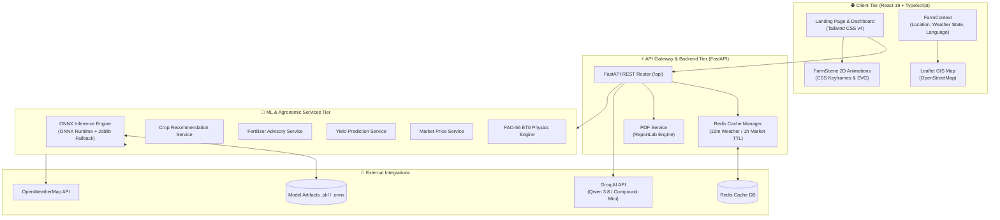
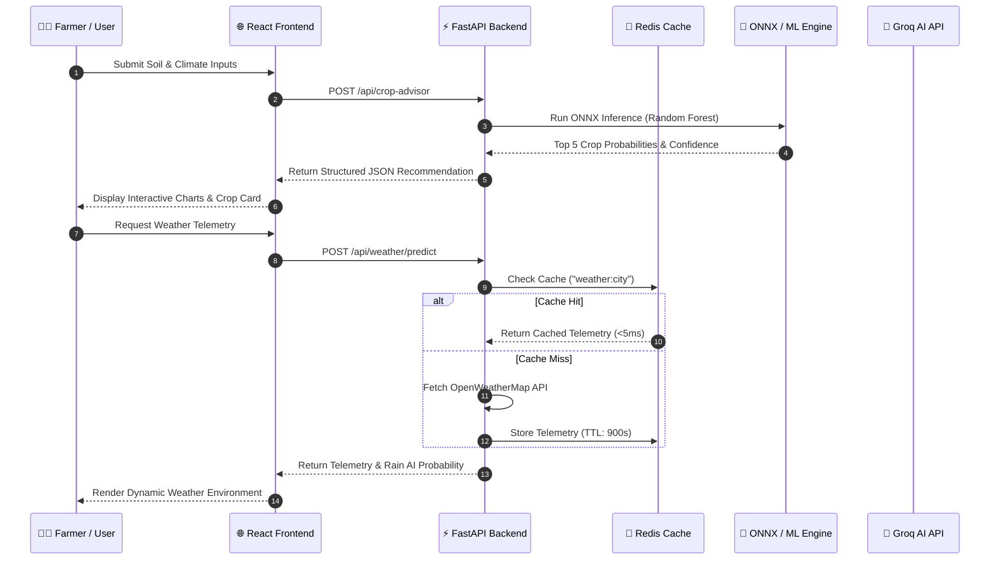

<div align="center">

# 🌾 FarmMate — Agricultural Intelligence Platform

### *Smarter Farming. Data-Driven Decisions. High-Yield Agriculture.*

AI-powered decision support system integrating machine learning models, OpenWeatherMap telemetry, FAO-56 evapotranspiration physics, Redis caching, ONNX inference, and Groq LLM assistance into a modern farmer-first platform.

[](LICENSE)
[](https://www.python.org/)
[](https://fastapi.tiangolo.com/)
[](https://react.dev/)
[](https://www.typescriptlang.org/)
[](https://www.docker.com/)
[](https://redis.io/)
[](https://groq.com/)

[**Explore Features**](#-key-features) • [**Architecture**](#%EF%B8%8F-system-architecture) • [**Quick Start (Docker)**](#-quick-start) • [**ML Models**](#-machine-learning-models) • [**Documentation**](#-documentation--api-reference)

---

</div>

## 📌 Table of Contents

- [Overview](#-overview)
- [Visual Showcase](#-visual-showcase)
- [Key Features](#-key-features)
- [System Architecture](#%EF%B8%8F-system-architecture)
- [Data & Inference Sequence Flow](#-data--inference-sequence-flow)
- [Technology Stack](#-technology-stack)
- [Project Structure](#-project-structure)
- [Quick Start](#-quick-start)
  - [Option 1: Docker Compose (Recommended)](#option-1-docker-compose-recommended)
  - [Option 2: Native Local Development](#option-2-native-local-development)
- [Environment Configuration](#-environment-configuration)
- [Machine Learning Engine](#-machine-learning-engine)
- [FarmMate AI Assistant](#-farmmate-ai-assistant)
- [Weather Intelligence & Adaptive UI](#-weather-intelligence--adaptive-ui)
- [Executive PDF Advisory Reports](#-executive-pdf-advisory-reports)
- [Security & Production Engineering](#-security--production-engineering)
- [Roadmap](#%EF%B8%8F-roadmap)
- [Contributing & License](#-contributing--license)

---

## 📖 Overview

**FarmMate** is an open-source, production-grade agricultural intelligence platform built to bridge the gap between complex agronomic science and practical farm management. By synthesizing soil nutrient analytics ($N, P, K$, pH), real-time micro-climate weather telemetry, FAO-56 Penman-Monteith evapotranspiration calculations, and machine learning prediction pipelines, FarmMate gives farmers and agronomists real-time actionable decision support.

The platform is designed with a high-performance **FastAPI** REST backend, an **ONNX Runtime** model inference engine, a **Redis** caching layer for weather and market data, an executive **PDF report generator**, and a responsive **React 19 + TypeScript** frontend with dynamic 2D agricultural animations.

> 💡 **Farmer-First Mission**: Technical ML probabilities and raw sensor figures are automatically translated into intuitive recommendations, interactive visualizations, and localized advice in English and Tamil.

---


---

## 🌟 Key Features

### 🌱 Agricultural Intelligence
- **🌾 Crop Advisor**: Analyzes Nitrogen, Phosphorus, Potassium, Soil pH, Temperature, Humidity, and Rainfall to recommend optimal crops using a trained **RandomForest Classifier**.
- **🧪 Fertilizer Guide**: Identifies soil nutrient deficits and calculates precise fertilizer dosage guidelines with built-in safety overrides for extreme pH levels.
- **💧 Water Management (FAO-56 ET₀)**: Computes daily reference evapotranspiration ($ET_0$) using the Penman-Monteith equation to provide crop water requirements in mm/day.
- **🚜 Harvest Yield Predictor**: Estimates crop production in Tonnes per Hectare based on field size, rainfall history, pesticide usage, and climate features using a **DecisionTree Regressor**.

### 🌦 Weather & Environmental Telemetry
- **🌤 Live Weather Telemetry**: Real-time sync with OpenWeatherMap API providing current temperature, humidity, wind speed, pressure, and cloudiness.
- **🌧 XGBoost Rain Probability Engine**: Evaluates localized rain probabilities for 24-hour periods to optimize irrigation scheduling.
- **❄️ Cold Wave & Frost Risk Alarm**: Evaluates micro-climate frost probabilities for 20 Indian agricultural districts using an **XGBoost Classifier**.
- **🗺 Interactive GIS Map**: Integrated Leaflet & OpenStreetMap interactive map for location selection and regional weather monitoring.

### 📈 Market & Executive Intelligence
- **📊 Mandi Price Forecasting**: Predicts wholesale vegetable commodity prices per quintal using a **Stacking Ensemble Regressor (XGBoost + LightGBM + CatBoost + Ridge)**.
- **📄 Executive PDF Advisory Reports**: Generates downloadable diagnostic PDF reports compiling soil test results, weather risk, fertilizer schedules, and yield forecasts via `ReportLab`.

### 🤖 AI Assistance & System Performance
- **💬 FarmMate AI Assistant**: Groq-powered conversational engine (`qwen/qwen3.8-27b`) with real-time farm context awareness supporting English and Tamil.
- **⚡ Redis Caching & ONNX Runtime**: High-throughput caching for weather and market data combined with ONNX Runtime model inference for fast CPU execution.

---

## 🏗️ System Architecture

FarmMate follows a decoupled micro-architecture designed for performance, resilience, and horizontal scalability.



---

## 🔄 Data & Inference Sequence Flow

The diagram below illustrates how FarmMate handles user requests, Redis cache lookups, ONNX model inference, and external API queries.



---

## 💻 Technology Stack

| Domain | Technologies Used |
| :--- | :--- |
| **Frontend Framework** | React 19, TypeScript, Vite |
| **Styling & Visuals** | Tailwind CSS v4, Vanilla CSS Design System, SVG 2D Animations |
| **Mapping & Charts** | Leaflet, React-Leaflet, OpenStreetMap, Recharts |
| **Backend Framework** | Python 3.11, FastAPI, Uvicorn, Pydantic |
| **Machine Learning** | Scikit-Learn, XGBoost, LightGBM, CatBoost, ONNX Runtime, Joblib |
| **Caching & Storage** | Redis (`redis-py` async client), Redis 7 Container |
| **AI Engine** | Groq SDK (`qwen/qwen3.8-27b`, `groq/compound-mini`) |
| **Reporting & Export** | ReportLab PDF Generation Engine |
| **DevOps & Containers** | Docker, Docker Compose, Nginx, GitHub Actions CI/CD |

---

## 📁 Project Structure

```text
FarmMate/
├── backend/                  # FastAPI REST Backend Service
│   ├── app/
│   │   ├── api/              # REST Endpoints (/chat, /crop, /weather, /report/pdf)
│   │   ├── schemas/          # Pydantic Request & Response Validation Schemas
│   │   └── main.py           # FastAPI Application Entrypoint
│   └── Dockerfile            # Multi-stage Python 3.11 Dockerfile
│
├── frontend/                 # React 19 + TypeScript Frontend Application
│   ├── public/               # Static Public Assets
│   ├── src/
│   │   ├── components/       # SmartImage, FarmScene, WeatherBackground, Navbar, Footer
│   │   ├── context/          # FarmContext (Location, Weather State, Language)
│   │   ├── pages/            # LandingPage, Dashboard, CropAdvisor, AIAssistant, etc.
│   │   ├── services/         # Axios API Client (`api.ts`)
│   │   └── App.tsx           # Routing & App Container
│   ├── Dockerfile            # Multi-stage Node 20 -> Nginx Production Dockerfile
│   └── nginx.conf            # Nginx Reverse Proxy Configuration
│
├── src/
│   └── farmmate/             # Core Agronomic Services & Utilities
│       ├── config/           # Central Settings & Environment Path Resolvers
│       ├── services/         # Crop, Fertilizer, Frost, Market, Yield, ET0, PDF Services
│       └── utils/            # Redis Cache Manager, ONNX Engine, Weather API
│
├── models/                   # Trained Machine Learning Model Artifacts (.pkl, .onnx)
├── data/                     # Raw & Processed Agricultural Datasets
├── docs/                     # Documentation & Visual Assets
│   └── assets/               # README Visual Screenshots & Diagrams
├── .github/
│   └── workflows/ci.yml      # GitHub Actions CI/CD Pipeline Workflow
├── docker-compose.yml        # Docker Multi-Container Orchestration Setup
├── requirements.txt          # Python Project Dependencies
└── README.md
```

---

## 🚀 Quick Start

### Option 1: Docker Compose (Recommended)

Ensure [Docker Desktop](https://www.docker.com/products/docker-desktop/) is installed and running, then start all services (`redis`, `backend`, `frontend`) with one command:

```bash
# Clone the repository
git clone https://github.com/Kumaran-NK/FarmMate.git
cd FarmMate

# Launch multi-container stack in detached mode
docker-compose up --build -d
```

- **React Frontend**: [http://localhost:5173](http://localhost:5173)
- **FastAPI Swagger Docs**: [http://localhost:8000/docs](http://localhost:8000/docs)
- **Redis Cache Instance**: `localhost:6379`

To stop the container stack:
```bash
docker-compose down
```

---

### Option 2: Native Local Development

#### Prerequisites
- **Python**: `3.11` or higher
- **Node.js**: `v20.0.0` or higher
- **npm**: `v9.0.0` or higher

#### 1. Backend Setup (FastAPI)

```bash
# Create and activate virtual environment
python -m venv env
# Windows:
.\env\Scripts\activate
# Linux/macOS:
source env/bin/activate

# Install Python dependencies
pip install -r requirements.txt

# Start FastAPI server
uvicorn backend.app.main:app --host 0.0.0.0 --port 8000 --reload
```
The API server will run at `http://localhost:8000`.

#### 2. Frontend Setup (React + Vite)

In a separate terminal:

```bash
cd frontend

# Install Node packages
npm install

# Start Vite development server
npm run dev
```
Access the application at `http://localhost:5173`.

---

## 🔑 Environment Configuration

Create a `.env` file in the root directory (based on [.env.example](file:///d:/FarmMate/.env.example)):

```env
# OpenWeatherMap API Key (Sign up at https://openweathermap.org/api)
OPENWEATHER_API_KEY=your_openweather_api_key_here

# Groq API Key (Sign up at https://console.groq.com)
GROQ_API_KEY=your_groq_api_key_here
GROQ_MODEL=qwen/qwen3.8-27b

# Redis Caching Settings
REDIS_HOST=localhost
REDIS_PORT=6379

# Application Settings
ENVIRONMENT=development
LOG_LEVEL=INFO
PORT=8000
```

> 🔒 **Security Notice**: `GROQ_API_KEY` and `OPENWEATHER_API_KEY` are kept strictly server-side by FastAPI and are **never** exposed in client browser bundles.

---

## 🧠 Machine Learning Models

FarmMate utilizes specialized machine learning models trained on agricultural datasets:

| Domain | Model Architecture | Inputs / Features | Primary Output Target | Artifact File |
| :--- | :--- | :--- | :--- | :--- |
| **Crop Recommendation** | RandomForest Classifier | N, P, K, pH, Temp, Humidity, Rainfall | Recommended crop & top 5 probabilities | `best_crop_model.pkl` |
| **Fertilizer Advisory** | ML + Rule Engine Overrides | Soil NPK, pH, Crop type, Soil moisture | Fertilizer type & dosage guidance | `simple_fertilizer_model.pkl` |
| **Frost Risk Alarm** | XGBoost Classifier | Min temp, Dew point, Humidity, Altitude | Frost risk level (Low / Moderate / High) | `frost_prediction_model.pkl` |
| **Rain AI Predictor** | XGBoost Classifier | Temp, Pressure, Humidity, Cloud cover | Rain probability (%) | `rain_model_xgb.joblib` |
| **Harvest Yield** | DecisionTree Regressor | Area (ha), Rainfall, Pesticides, Temp | Expected yield (Tonnes & hg/ha) | `dtr_model.pkl` |
| **Market Prices** | Stacking Ensemble (XGB+LGBM+CatBoost+Ridge) | Vegetable, Market district, Month, Temp | Wholesale Mandi price (₹/quintal) | `vegetable_price_stack.pkl` |

---

## 🤖 FarmMate AI Assistant

FarmMate AI provides localized agronomic decision support powered by Groq's low-latency inference engine (`qwen/qwen3.8-27b` / `groq/compound-mini`).

```text
React AIAssistant UI  ──>  FastAPI (/api/chat)  ──>  FarmContext Injector  ──>  Groq AI Cloud API
```

### Key Capabilities:
- **Farm Context Awareness**: Automatically injects active crop recommendations, location, and live weather telemetry into system prompts.
- **Multilingual Query Support**: Handles questions in English, Tamil (e.g., *"Tomorrow rain varuma?"*), and regional phrases.
- **Polished Offline Resilience**: If Groq API rate limits occur, the system responds with a branded assistance message instead of dumping technical errors.

---

## 🌦 Weather Intelligence & Adaptive UI

FarmMate features a weather-aware UI engine. The OpenWeatherMap telemetry automatically updates the application context, triggering smooth ambient CSS/SVG animations in the `FarmScene` component.

| Weather Condition | Visual Background & Animation State |
| :--- | :--- |
| **☀️ Sunny** | Warm golden gradient, pulsing animated sun glow, gentle crop sway |
| **⛅ Partly Cloudy** | Soft blue sky, drifting SVG cloud layers |
| **🌧 Rain / Storm** | Dark slate atmosphere, falling rain line animations |
| **🌫 Fog / Frost** | Muted backdrop with translucent frost/fog overlay |

---

## 📄 Executive PDF Advisory Reports

FarmMate includes an executive PDF report generator powered by `ReportLab`. Farmers can click **Export PDF Report** on the Dashboard to download a printable diagnostic summary:

- **Soil Diagnostic Table**: Measured NPK and pH values compared against optimal agronomic ranges.
- **Crop Advisor Match**: Model recommendation, confidence percentage, and suitability justification.
- **Weather & Irrigation Summary**: Temperature, 24-hour rain probability, and FAO-56 $ET_0$ water guidance.

---

## 🛡 Security & Production Engineering

- **API Key Protection**: Server-side proxying prevents API key leaks.
- **Redis Cache Safety**: Async connection manager falls back gracefully to direct computation if Redis is offline.
- **ONNX Model Decoupling**: Models are executed via ONNX Runtime to avoid Python package version locking.
- **CI/CD Quality Gate**: GitHub Actions runs automated `pytest` backend suites and `tsc` frontend checks on every push.

---

## 🗺️ Roadmap

- [x] Machine Learning Crop Recommendation & Fertilizer Advisor
- [x] FAO-56 Reference Evapotranspiration ($ET_0$) Calculation
- [x] Groq LLM AI Assistant with Farm Context Support
- [x] Redis Telemetry Caching & ONNX Model Inference Engine
- [x] Multi-Container Docker Compose Setup & GitHub Actions CI/CD Pipeline
- [x] Executive PDF Advisory Report Exporting
- [ ] Retrieval-Augmented Generation (RAG) using ChromaDB vector store
- [ ] Computer Vision Crop Disease Diagnosis via Leaf Photo Uploads
- [ ] Real-time MQTT / WebSocket IoT Soil Sensor Streaming

---

## 🤝 Contributing & License

Contributions are welcome! Please follow these steps:

1. Fork the repository
2. Create your feature branch (`git checkout -b feature/amazing-feature`)
3. Commit your changes (`git commit -m 'Add amazing feature'`)
4. Push to the branch (`git push origin feature/amazing-feature`)
5. Open a Pull Request

Distributed under the **MIT License**. See [`LICENSE`](LICENSE) for more details.

---

<div align="center">

**FarmMate AI** — Empowering sustainable agricultural ecosystems with precision intelligence.

</div>
