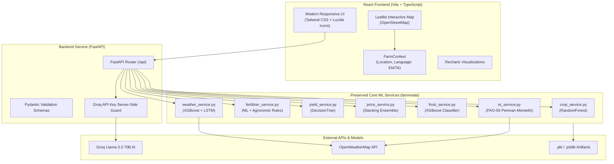

# 🌾 FarmMate — Agricultural Intelligence Platform

[](https://react.dev/)
[](https://fastapi.tiangolo.com/)
[](https://scikit-learn.org/)
[](https://groq.com/)
[](LICENSE)

**FarmMate** is a full-stack, data-driven agricultural decision support web platform designed to empower farmers, agronomists, and agricultural researchers. It combines trained Machine Learning prediction models, real-time OpenWeatherMap telemetry, FAO-56 Penman-Monteith evapotranspiration formulas, interactive Leaflet mapping, and a server-side **Groq-powered AI Assistant** into a modern farmer-first web application.

---

## 🌟 Key Features

- **🌾 Smart Crop Advisor**: Recommends optimal crops based on soil nutrients ($N, P, K$), pH, temperature, humidity, and rainfall using a trained **RandomForest Classifier**.
- **🧪 Fertilizer Guide**: Identifies soil nutrient deficits and recommends exact fertilizer application with built-in agronomic safety overrides for extreme pH levels.
- **💧 FAO-56 Water Management & ET0 Calculator**: Computes reference evapotranspiration ($ET_0$) and daily crop water requirements (in mm/day) to guide irrigation scheduling.
- **❄️ Cold Wave & Frost Alarm**: Evaluates localized frost risk probability for 20 Indian agricultural regions using a trained **XGBoost Classifier**.
- **🌤️ Weather Telemetry & Rain AI**: Integrates live OpenWeatherMap forecast telemetry with an **XGBoost Rain Classifier** to distinguish official weather forecasts from localized ML predictions.
- **🚜 Harvest Yield Predictor**: Forecasts crop production in tonnes per hectare based on land area, rainfall, pesticide usage, and climate features using a **DecisionTree Regressor**.
- **📈 Mandi Market Price Advisor**: Predicts wholesale vegetable commodity market prices per quintal using a **Stacking Ensemble Regressor (XGBoost + LightGBM + CatBoost + Ridge)** and provides supply chain logistics advice.
- **🤖 FarmMate AI Assistant**: Server-side Groq Llama-3.3 70B conversational interface supporting English, Tamil, and regional farming queries with real-time farm context.
- **🗺️ Interactive Farm Map**: Integrated Leaflet & OpenStreetMap interactive map enabling location selection and regional weather context visualization.

---

## 🏗️ System Architecture



---

## 💻 Technology Stack

### Frontend
- **Framework**: React 18, TypeScript, Vite
- **Styling**: Tailwind CSS v4, Vanilla CSS Design System, Glassmorphism, Google Fonts (*Plus Jakarta Sans*)
- **Icons**: Lucide-React
- **Mapping**: Leaflet, React-Leaflet, OpenStreetMap
- **Charts**: Recharts
- **HTTP Client**: Axios

### Backend & Machine Learning
- **Framework**: FastAPI, Uvicorn, Pydantic
- **Language**: Python 3.11+
- **Machine Learning**: Scikit-Learn, XGBoost, LightGBM, CatBoost, TensorFlow / Keras, Joblib, Pandas, NumPy
- **AI Integration**: Groq SDK (`llama-3.3-70b-versatile`)
- **Testing**: Pytest, FastAPI TestClient

---

## 📁 Project Structure

```text
FarmMate/
├── backend/                  # FastAPI REST API Backend
│   ├── app/
│   │   ├── api/              # REST Endpoints (/api/crop, /api/chat, etc.)
│   │   ├── schemas/          # Pydantic Request & Response Schemas
│   │   └── main.py           # FastAPI Application Entrypoint
│   ├── tests/                # Backend API Integration Tests
│   └── requirements.txt      # Backend Python Dependencies
│
├── frontend/                 # React 18 + TypeScript Application
│   ├── public/               # Static Assets
│   ├── src/
│   │   ├── components/       # Navbar, Footer, InteractiveMap, MetricCard, AlertBanner
│   │   ├── context/          # FarmContext (Location, Language, Prediction State)
│   │   ├── pages/            # Dashboard, CropAdvisor, FertilizerAdvisor, WeatherPage, etc.
│   │   ├── services/         # Axios API Client (`api.ts`)
│   │   ├── types/            # TypeScript Interfaces (`index.ts`)
│   │   ├── App.tsx           # Router & App Layout
│   │   └── main.tsx          # React Root Entrypoint
│   ├── package.json
│   └── vite.config.ts
│
├── src/
│   └── farmmate/             # Preserved Core ML Services & Utilities
│       ├── config/           # Central Settings & Environment Paths
│       ├── services/         # ML Prediction & Agronomic Services
│       └── utils/            # Weather API Helper
│
├── models/                   # Trained ML Model Artifacts (.pkl, .joblib, .h5)
├── data/                     # Raw & Processed Agricultural Datasets
├── tests/                    # Core ML Service Unit Tests
├── app.py                    # Legacy Internal Streamlit Debugging Interface
├── .env.example              # Environment Configuration Template
├── pyproject.toml
├── requirements.txt          # Root Python Requirements
└── README.md
```

---

## 🔑 Environment Configuration

Create a `.env` file in the root project directory:

```env
# FarmMate Configuration & Environment Variables

# OpenWeatherMap API Key (Sign up at https://openweathermap.org/api)
OPENWEATHER_API_KEY=openweather_api_key

# Groq API Key (Sign up at https://console.groq.com)
GROQ_API_KEY= your_groq_api_key_here

# Application Settings
ENVIRONMENT=development
LOG_LEVEL=INFO
PORT=8000
```

> ⚠️ **Security Notice**: `GROQ_API_KEY` is loaded strictly server-side by the FastAPI backend (`backend/app/api/endpoints.py`) and is **never** exposed to the frontend browser bundle.

---

## 🚀 Running FarmMate Locally

### Step 1: Clone Repository & Setup Environment

```bash
cd d:\FarmMate
```

### Step 2: Start Python FastAPI Backend

Activate Python virtual environment and install backend dependencies:

```bash
.\env\Scripts\python.exe -m pip install -r backend/requirements.txt
```

Start the FastAPI server:

```bash
.\env\Scripts\python.exe -m uvicorn backend.app.main:app --host 0.0.0.0 --port 8000 --reload
```

The REST API will be available at `http://localhost:8000` with interactive Swagger API docs at `http://localhost:8000/docs`.

### Step 3: Start React TypeScript Frontend

In a separate terminal, navigate to `frontend/`:

```bash
cd frontend
npm install
npm run dev
```

Open your browser at `http://localhost:5173` to access the full FarmMate web application.

---

## 🤖 Machine Learning Models Summary

| Model Domain | Algorithm | Output Target | Artifact File |
| :--- | :--- | :--- | :--- |
| **Crop Recommendation** | RandomForest Classifier | Optimal crop name & top 5 probabilities | `best_crop_model.pkl` |
| **Fertilizer Advisory** | ML + Rule Engine Overrides | Fertilizer type & dosage guidance | `simple_fertilizer_model.pkl` |
| **Frost Risk Alarm** | XGBoost Classifier | Frost risk level (Low / Moderate / High) | `frost_prediction_model.pkl` |
| **Rain AI Predictor** | XGBoost Classifier | Rain probability % | `rain_model_xgb.joblib` |
| **Harvest Yield** | DecisionTree Regressor | Production (hg/ha and total Tonnes) | `dtr_model.pkl` |
| **Market Prices** | Stacking Regressor (XGB + LGBM + CatBoost + Ridge) | Wholesale Mandi price per quintal | `vegetable_price_stack.pkl` |

---

## 🧪 Testing & Verification

### Backend Unit & API Tests

Run full Python test suite (both core ML services and FastAPI endpoints):

```bash
$env:PYTHONPATH="src;."
.\env\Scripts\python.exe -m pytest backend/tests/ tests/
```

### Frontend Production Build

Validate TypeScript compilation and Vite bundle generation:

```bash
cd frontend
npm run build
```

---

## 📄 License & Attribution

FarmMate is open-source under the MIT License. Weather data powered by OpenWeatherMap API. Conversational AI powered by Groq Llama-3.3 70B. Maps powered by Leaflet and OpenStreetMap.

---

## 📝 Resume Summary Bullets

- **Full-Stack Agricultural Platform Engineering**: Architected and deployed a production-grade web platform combining a React 18/TypeScript frontend and Python FastAPI REST backend, processing real-time telemetry and 7 Machine Learning prediction pipelines.
- **Secure AI Integration**: Engineered a server-side Groq Llama-3.3 70B conversational AI Assistant with real-time farm context awareness, maintaining zero API key exposure in client browser bundles.
- **Data Visualization & GIS Mapping**: Integrated FAO-56 Penman-Monteith evapotranspiration calculations, Recharts analytics, and interactive Leaflet GIS mapping to deliver actionable, farmer-friendly decision support.
